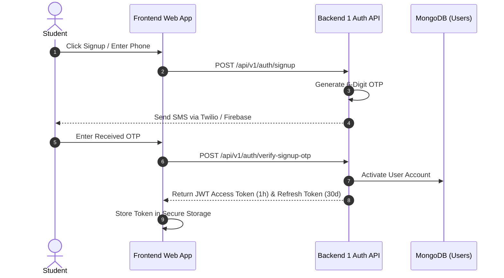
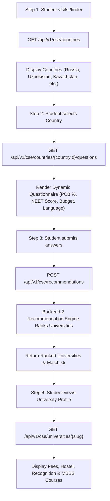
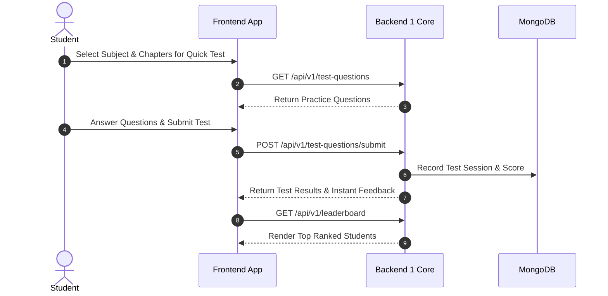
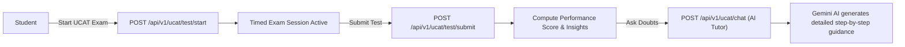

# 🗺️ MBBS.NET User Flow & Architecture Diagrams

This document details the end-to-end user flows and system interactions across **MBBS Backend 1 (Core Engine)** and **MBBS Backend 2 (CSE Finder Engine)**.

---

## 1. Student Authentication & Onboarding Flow

---

## 2. CSE Open University Finder Flow (Backend 2 Integration)

---

## 3. NEET Practice & Quick Test Flow

---

## 4. UCAT Preparation & AI Study Assistant Flow

---

## 5. Summary of System Interactions Between Backend 1 and Backend 2

| User Action | Backend Handling Request | Description |
| :--- | :--- | :--- |
| **Login / Token Issuance** | `MBBS Backend 1` | Generates JWT Signed with shared `SECRET_KEY`. |
| **NEET Prep & PYQ** | `MBBS Backend 1` | Serves Question Bank, Streaks & Leaderboards. |
| **UCAT & AI Assistant** | `MBBS Backend 1` | Integrates with Gemini AI & UCAT Engine. |
| **University Search & Eligibility** | `MBBS Backend 2` | Evaluates eligibility criteria and outputs matching MBBS universities. |
| **Admin Operations** | `Backend 1` & `Backend 2` | Backend 1 manages Blogs/Users; Backend 2 manages Universities/Courses. |
